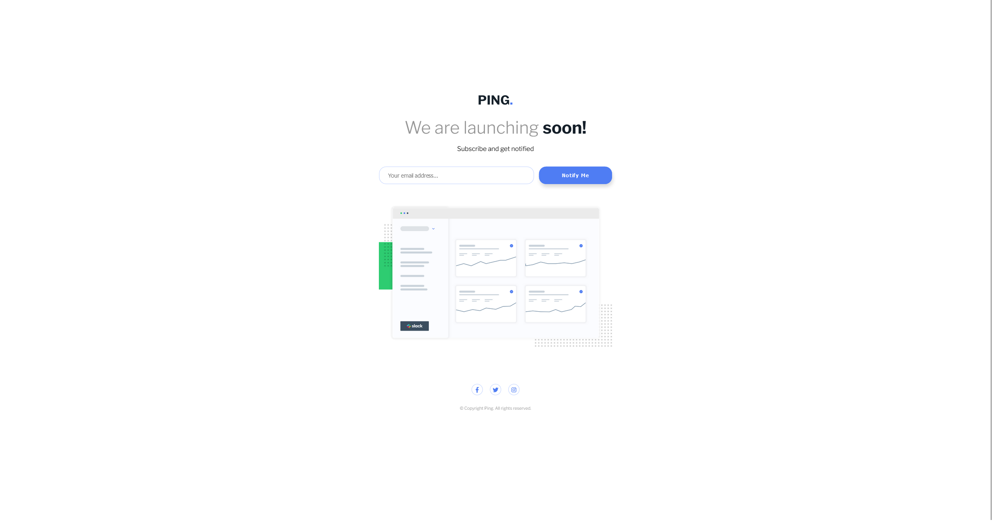

# Frontend Mentor - Ping coming soon page solution

## Table of contents

- [Overview](#overview)
  - [The challenge](#the-challenge)
  - [Screenshot](#screenshot)
  - [Links](#links)
- [My process](#my-process)
  - [Built with](#built-with)

- [Author](#author)

## Overview

### The challenge

Users should be able to:

- View the optimal layout for the site depending on their device's screen size
- See hover states for all interactive elements on the page
- Submit their email address using an `input` field
- Receive an error message when the `form` is submitted if:
	- The `input` field is empty. The message for this error should say *"Whoops! It looks like you forgot to add your email"*
	- The email address is not formatted correctly (i.e. a correct email address should have this structure: `name@host.tld`). The message for this error should say *"Please provide a valid email address"*

### Screenshot

### Links

- Frontend Mentor Solution URL: [monte-dev](https://www.frontendmentor.io/solutions/ping-single-column-coming-soon-page-SItvK1cpTj)
- Live Site URL: [monte-dev](https://monte-dev.github.io/4-ping-coming-soon-email-validation/)
- Repo URL: [monte-dev](https://github.com/monte-dev/4-ping-coming-soon-email-validation)

## My process

For email validation I opted for using a simple .match method and matched users input against a regular expression for mail format.

### Built with

- Semantic HTML5 markup
- Vanilla Javascript
- Flexbox
- Mobile-first workflow

## Author

- Website - [monte-dev](https://www.github.com/monte-dev/)
- Frontend Mentor - [@monte-dev](https://www.frontendmentor.io/profile/monte-dev)
